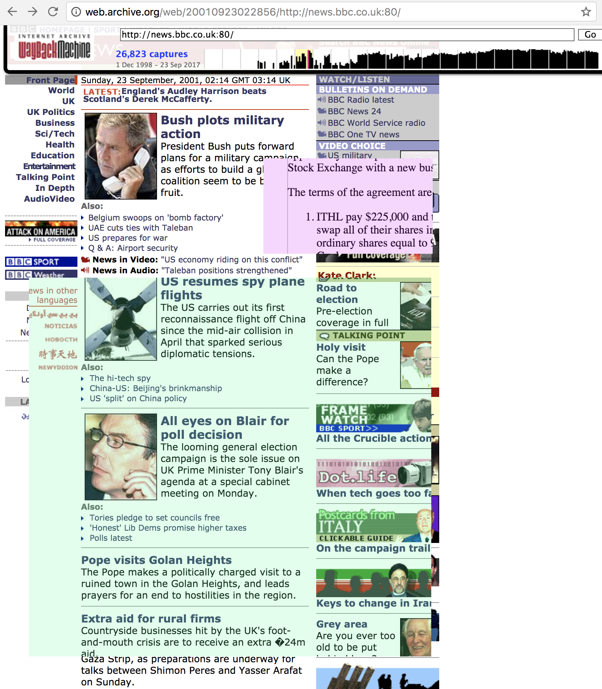

# waypatch

Chrome extension to move rectangular 'patches' of a page backward in
time using the Wayback Machine.

## Usage

Install the unpacked extension. Open a Wayback Machine page.

Wait a bit (for it to retrieve the page history), and then you should
be able to Alt-drag a solid colored rectangle out on the page.

Then normal-drag the rectangle left to pick a date, let go, and that
patch will load from the past.
